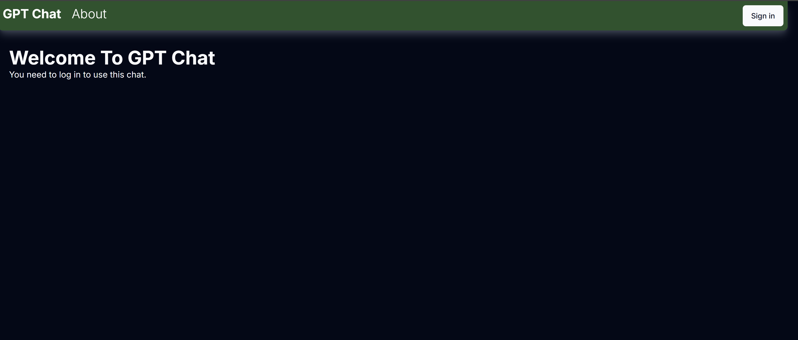
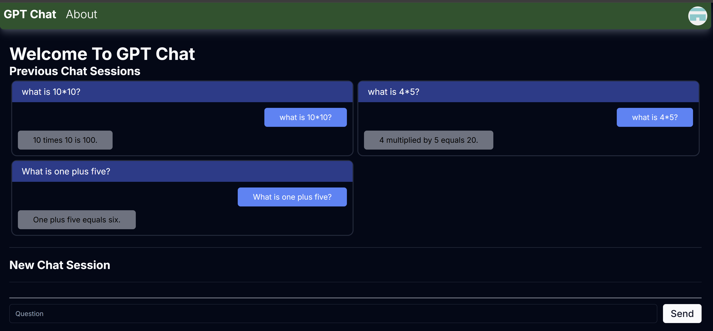
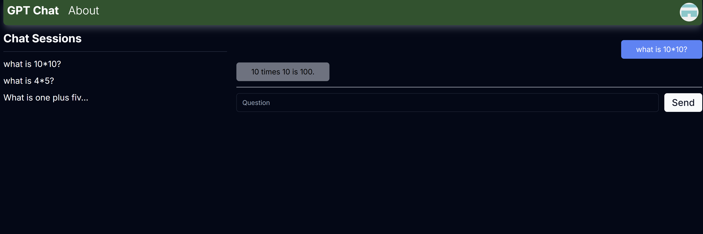

## Table of contents

- [Overview](#overview)
  - [Screenshots](#screenshots)
  - [Links](#links)
- [My process](#my-process)
  - [Built with](#built-with)
  - [What I learned](#what-i-learned)
  - [Continued development](#continued-development)

## Overview

### Screenshots

### Links

- Live Site URL: [chat-gpt-app](https://chat-gpt-app-eta-eight.vercel.app/)

## My process

### Built with

- Next.js
- TypeScript
- Tailwind CSS
- shadcn/ui
- NextAuth.js
- OpenAI API
- PostgreSQL (Neon Database)

### What I learned

- How to integrate OpenAI's API for generating chat completions.
- Implementing authentication using NextAuth.js.
- Managing state and server-side rendering with Next.js.
- Using Tailwind CSS for styling and creating responsive designs.
- Handling database operations with PostgreSQL and Neon Database.

### Continued development

In future projects, I want to continue focusing on the following areas:

- Enhancing the user interface and user experience.
- Implementing more advanced features using OpenAI's API.
- Improving performance and scalability of the application.
- Exploring other authentication methods and improving security.
- Deepening my knowledge of database optimization and management.
